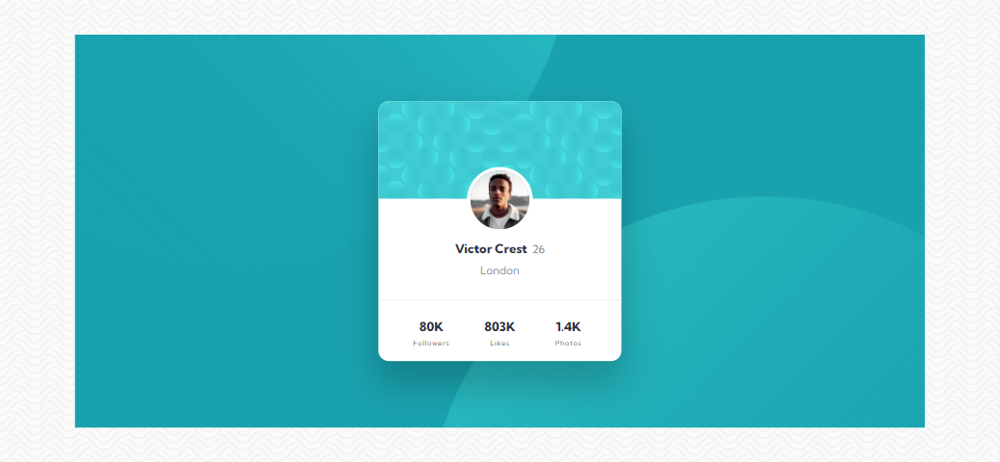
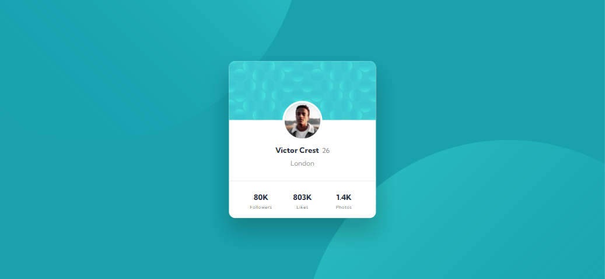

# Frontend Mentor - Profile card component solution

This is a solution to the [Profile card component challenge on Frontend Mentor](https://www.frontendmentor.io/challenges/profile-card-component-cfArpWshJ). Frontend Mentor challenges help you improve your coding skills by building realistic projects. 

## Table of contents

- [Overview](#overview)
  - [The challenge](#the-challenge)
  - [Screenshot](#screenshot)
  - [Links](#links)
- [My process](#my-process)
  - [Built with](#built-with)
  - [What I learned](#what-i-learned)
- [Author](#author)

## Overview

### The challenge

- Build out the project to the designs provided

### Screenshot

### Links

- Solution URL: https://www.frontendmentor.io/solutions/profile-card-component-with-css-flexbox-and-css-grid-AIBt0VSel
- Live Site URL: https://eager-neumann-d13ddb.netlify.app/

## My process

### Built with

- Semantic HTML5 markup
- CSS custom properties
- Flexbox
- CSS Grid

### What I learned

At first I got a little problem with the background position but then I remembered to use the ::before and ::after property to adjust the circle on the background.

## Author

- Frontend Mentor - [@Indanarishi](https://www.frontendmentor.io/profile/Indanarishi)
- Twitter - [@Indanarishi_](https://www.twitter.com/Indanarishi_)
